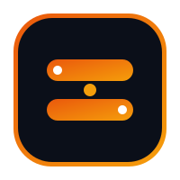

<p align="center">
  
</p>

<h1 align="center">SETARA</h1>

<p align="center">
  <strong>Komunikasi Tanpa Batas, Setara untuk Semua</strong>
</p>

<p align="center">
  Platform Penerjemah Bahasa Isyarat Indonesia berbasis AI yang mendukung <strong>SIBI</strong> (Sistem Isyarat Bahasa Indonesia) dan <strong>BISINDO</strong> (Bahasa Isyarat Indonesia) secara real-time.
</p>

<p align="center">
  
  
  
  
  
</p>

---

## 📋 Daftar Isi

- [Tentang Proyek](#-tentang-proyek)
- [Fitur Utama](#-fitur-utama)
- [Tech Stack](#-tech-stack)
- [Struktur Proyek](#-struktur-proyek)
- [Instalasi & Menjalankan](#-instalasi--menjalankan)
- [Halaman & Routing](#-halaman--routing)
- [Roadmap](#-roadmap)
- [Tim Pengembang](#-tim-pengembang)
- [Lisensi](#-lisensi)

---

## 🌟 Tentang Proyek

**SETARA** adalah platform web penerjemah bahasa isyarat Indonesia yang dirancang untuk menjembatani komunikasi antara komunitas Tuli dan masyarakat umum. Platform ini memanfaatkan teknologi **Computer Vision** dan **AI** untuk menerjemahkan teks menjadi peragaan isyarat (Text-to-Sign) serta mendeteksi gestur isyarat dari kamera menjadi teks (Sign-to-Text) secara real-time.

### Mengapa SETARA?

Indonesia memiliki **2,5 juta** penyandang tuna rungu, namun aksesibilitas komunikasi digital masih sangat terbatas. SETARA hadir untuk:

- 🤟 **Menerjemahkan teks ke bahasa isyarat** dengan animasi 21 titik sendi tangan
- 📸 **Mendeteksi gestur isyarat dari kamera** menggunakan model YOLO 11 Pose
- 📚 **Mengedukasi masyarakat** tentang perbedaan SIBI dan BISINDO
- 🌍 **Membangun komunitas inklusif** yang setara untuk semua

---

## ✨ Fitur Utama

### 🔄 Penerjemah Dua Arah (Dual Engine)

| Fitur | Deskripsi |
|-------|-----------|
| **Text to Sign** | Ketik kalimat → sistem memecah menjadi token kata → memutar animasi isyarat 21 keypoints secara berurutan |
| **Sign to Text** | Aktifkan webcam → model AI mendeteksi gestur tangan → menerjemahkan menjadi teks secara real-time |
| **SIBI Engine** | Mendukung Sistem Isyarat Bahasa Indonesia (konteks formal/pendidikan) |
| **BISINDO Engine** | Mendukung Bahasa Isyarat Indonesia (percakapan alami komunitas Tuli) |

### 🎨 Desain & UI/UX

- **Dynamic Island Navbar** — Navbar full-width saat idle, mengecil menjadi floating capsule saat scroll
- **Glassmorphism Design System** — Desain modern dengan backdrop blur, gradient, dan micro-animations
- **Dark Mode** — Dukungan tema gelap yang responsif
- **Orange & Amber Palette** — Identitas visual hangat dan inklusif
- **Smooth Page Transitions** — Animasi perpindahan halaman yang mulus

### 📄 Halaman Landing

- **Hero Section** — CTA utama dengan animasi pulse glow
- **Bento Grid Fitur** — Showcase fitur unggulan dalam layout grid modern
- **Edukasi SIBI vs BISINDO** — Perbandingan mendalam dua sistem isyarat
- **How It Works** — Panduan langkah demi langkah
- **Berita & Artikel** — Konten edukasi terkini
- **Timeline Milestone** — Perjalanan dan pencapaian komunitas
- **Komunitas** — Aktivitas dan testimoni pengguna
- **Tentang Kami** — Visi, misi, dan tim pengembang

### 🔐 Admin Dashboard

- **Login Page** — Autentikasi dengan halaman login premium
- **Manajemen Konten** — CRUD berita, kosakata isyarat, timeline, dan komunitas
- **Akses via URL** — Hanya dapat diakses melalui `/admin`

---

## 🛠 Tech Stack

### Frontend (Fase 1 — ✅ Selesai)

| Teknologi | Versi | Kegunaan |
|-----------|-------|----------|
| **React** | 18.3 | Library UI komponen |
| **Vite** | 6.1 | Build tool & dev server |
| **Tailwind CSS** | 3.4 | Utility-first CSS framework |
| **Zustand** | 5.0 | State management ringan |
| **Lucide React** | 0.475 | Icon library |
| **Canvas Confetti** | 1.9 | Efek celebrasi |

### Backend (Fase 2 — 🔜 Segera)

| Teknologi | Kegunaan |
|-----------|----------|
| **Django 5** | Web framework Python |
| **Django Ninja** | REST API framework |
| **SQLite / PostgreSQL** | Database |
| **YOLO 11 Pose** | Model deteksi gestur tangan |

---

## 📁 Struktur Proyek

```
setara/
├── frontend/                          # Aplikasi React (Vite)
│   ├── public/
│   │   ├── favicon.svg
│   │   ├── icons.svg
│   │   └── logo-setara.svg
│   ├── src/
│   │   ├── assets/                    # Aset statis
│   │   ├── components/
│   │   │   ├── admin/
│   │   │   │   ├── AdminDashboard.jsx # Dashboard CMS administrator
│   │   │   │   └── AdminLoginPage.jsx # Halaman login admin
│   │   │   ├── common/
│   │   │   │   ├── Navbar.jsx         # Dynamic island navbar
│   │   │   │   └── Footer.jsx         # Footer global
│   │   │   ├── landing/
│   │   │   │   ├── HeroSection.jsx    # Hero banner & CTA
│   │   │   │   ├── BentoFeatures.jsx  # Grid showcase fitur
│   │   │   │   ├── SibiBisindoSection.jsx # Edukasi SIBI vs BISINDO
│   │   │   │   ├── HowItWorks.jsx     # Cara kerja platform
│   │   │   │   ├── NewsSection.jsx    # Berita & artikel
│   │   │   │   ├── TimelineSection.jsx# Timeline milestone
│   │   │   │   ├── CommunitySection.jsx # Komunitas
│   │   │   │   └── AboutSection.jsx   # Tentang kami
│   │   │   └── translator/
│   │   │       ├── TranslatorPage.jsx # Halaman penerjemah mandiri
│   │   │       ├── TranslatorHub.jsx  # Hub utama penerjemah
│   │   │       ├── TextToSignPlayer.jsx # Pemutar teks ke isyarat
│   │   │       ├── SignToTextCamera.jsx # Kamera ke teks (AI)
│   │   │       └── SignCanvasAnimator.jsx # Animator canvas 21 keypoints
│   │   ├── services/                  # API service layer
│   │   ├── stores/
│   │   │   ├── useAuthStore.js        # State autentikasi
│   │   │   ├── useThemeStore.js       # State tema (light/dark)
│   │   │   ├── useTranslatorStore.js  # State penerjemah
│   │   │   └── useContentStore.js     # State konten CMS
│   │   ├── utils/                     # Utility functions
│   │   ├── App.jsx                    # Root app & client-side routing
│   │   ├── index.css                  # Global styles & animations
│   │   └── main.jsx                   # Entry point React
│   ├── index.html
│   ├── package.json
│   ├── tailwind.config.js
│   ├── postcss.config.js
│   └── vite.config.js
├── PRD_SIBI_BISINDO_Translator_v2.0.md # Product Requirements Document
└── README.md
```

---

## 🚀 Instalasi & Menjalankan

### Prasyarat

- **Node.js** ≥ 18.x
- **npm** ≥ 9.x

### Langkah Instalasi

```bash
# 1. Clone repository
git clone https://github.com/username/setara.git
cd setara

# 2. Masuk ke direktori frontend
cd frontend

# 3. Install dependencies
npm install

# 4. Jalankan development server
npm run dev
```

Aplikasi akan berjalan di **[http://localhost:5173](http://localhost:5173)**

### Build Produksi

```bash
npm run build
npm run preview
```

---

## 🗺 Halaman & Routing

| Route | Halaman | Deskripsi |
|-------|---------|-----------|
| `/` | Homepage | Landing page lengkap dengan semua section |
| `/penerjemah` | Penerjemah | Halaman penerjemah isyarat AI mandiri |
| `/admin` | Admin Login | Halaman login administrator (memerlukan autentikasi) |

### Kredensial Demo Admin

| Field | Nilai |
|-------|-------|
| Email | `admin@setara.id` |
| Password | `setara2026` |

---

## 🗓 Roadmap

### Fase 1: Frontend Development ✅

- [x] Landing page (Hero, Bento, Edukasi, Berita, Timeline, Komunitas, Tentang)
- [x] Penerjemah dua arah (Text-to-Sign & Sign-to-Text UI)
- [x] Animator canvas 21 keypoints skeleton tangan
- [x] Dynamic island navbar dengan scroll animation
- [x] Client-side routing (`/`, `/penerjemah`, `/admin`)
- [x] Admin dashboard dengan login authentication gate
- [x] Dark mode & responsive design
- [x] Orange & amber design system

### Fase 2: Backend Development 🔜

- [ ] Django 5 + Django Ninja REST API
- [ ] Database schema (SQLite → PostgreSQL)
- [ ] Strategy Pattern untuk SIBI/BISINDO engine
- [ ] Adapter Pattern untuk YOLO 11 detector
- [ ] JWT authentication & authorization

### Fase 3: Full-Stack Integration 📋

- [ ] Koneksi frontend ↔ backend API
- [ ] Real-time WebSocket untuk deteksi kamera
- [ ] Upload & manajemen dataset video isyarat
- [ ] CMS admin dengan data persisten

### Fase 4: AI & YOLO 11 Integration 📋

- [ ] Integrasi model YOLO 11 Pose
- [ ] Training dataset SIBI & BISINDO
- [ ] Real-time 21 keypoint hand detection
- [ ] Optimasi inference (30+ FPS target)

### Fase 5: Polish & Competition Ready 📋

- [ ] Performance optimization & Lighthouse audit
- [ ] Accessibility (WCAG 2.1 AA compliance)
- [ ] SEO optimization
- [ ] Documentation & deployment guide
- [ ] Demo video & presentation deck

---

## 👥 Tim Pengembang

**SETARA** dikembangkan dengan dedikasi untuk menciptakan komunikasi yang inklusif dan setara bagi seluruh masyarakat Indonesia.

---

## 📄 Lisensi

Proyek ini dilisensikan di bawah **MIT License** — lihat file [LICENSE](LICENSE) untuk detail.

---

<p align="center">
  <strong>SETARA</strong> — Komunikasi Tanpa Batas, Setara untuk Semua 🤟
</p>
