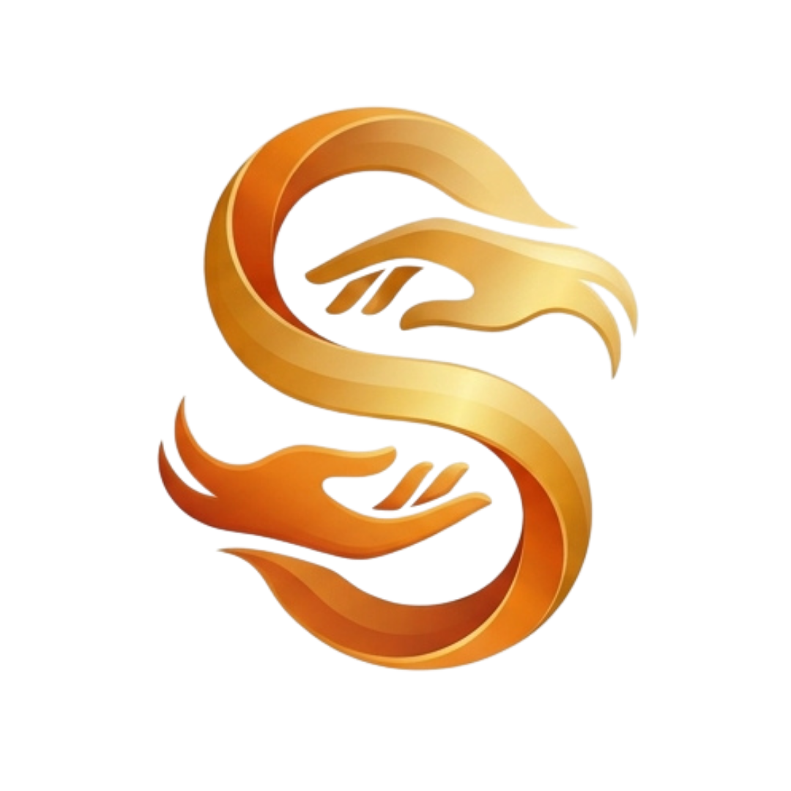

<p align="center">
  
</p>

<h1 align="center">SETARA</h1>

<p align="center">
  <strong>Komunikasi Tanpa Batas, Setara untuk Semua</strong>
</p>

<p align="center">
  Platform Penerjemah Bahasa Isyarat Indonesia berbasis AI yang mendukung <strong>SIBI</strong> (Sistem Isyarat Bahasa Indonesia) dan <strong>BISINDO</strong> (Bahasa Isyarat Indonesia) secara real-time dengan pemutar animasi 21 keypoints dan video peraga asli PostgreSQL.
</p>

<p align="center">
  
  
  
  
  
  
  
  
</p>

---

## 📋 Daftar Isi

- [Tentang Proyek](#-tentang-proyek)
- [Fitur Utama](#-fitur-utama)
- [Tech Stack](#-tech-stack)
- [Struktur Proyek](#-struktur-proyek)
- [Instalasi & Menjalankan](#-instalasi--menjalankan)
- [Halaman & Routing](#-halaman--routing)
- [Roadmap & Progres](#-roadmap--progres)
- [Afiliasi & Institusi](#-afiliasi--institusi)
- [Tim Pengembang](#-tim-pengembang)
- [Lisensi](#-lisensi)

---

## 🌟 Tentang Proyek

**SETARA** adalah solusi teknologi inklusif yang dirancang untuk menjembatani kesenjangan komunikasi antara teman Tuli dan masyarakat umum di Indonesia. Mengintegrasikan kemudahan akses web modern dengan kecerdasan buatan, SETARA menghadirkan penerjemah bahasa isyarat dua arah (_Text-to-Sign_ dan _Sign-to-Text_) yang presisi dan mudah dipelajari.

### Nilai Utama:

- 🤝 **Aksesibilitas Tanpa Batas**: Antarmuka responsif dan ramah pembaca layar (WCAG 2.1 AA compliant)
- 📚 **Edukasi Komprehensif**: Mendukung dua dialek isyarat utama nasional (SIBI dan BISINDO)
- ⚡ **Dual-Mode Visualizer**: Pilihan visualisasi antara animasi rangka gestur 21 keypoints dan video peraga manusia asli MP4
- 🌍 **Inklusivitas Komunitas**: Mendorong integrasi sosial, pendidikan, dan profesionalitas disabilitas sensorik rungu

---

## ✨ Fitur Utama

### 🔄 Penerjemah Dua Arah (Dual Engine & Dual Mode)

| Fitur                             | Deskripsi                                                                                                           | Status                 |
| --------------------------------- | ------------------------------------------------------------------------------------------------------------------- | ---------------------- |
| **Dual Engine (SIBI & BISINDO)**  | Pilihan penerjemahan antara konteks formal edukasi (SIBI) dan percakapan harian komunitas Tuli (BISINDO)            | ✅ Aktif               |
| **Text to Sign (FSM Sequential)** | Tokenisasi kalimat otomatis dengan pemutaran sekuensial, pengaturan kecepatan playback (0.5x - 2.0x), dan loop      | ✅ Aktif               |
| **Dual-Mode Visualizer**          | Toggle instan antara pemutar **Animasi Canvas 2D (21 keypoints)** dan **Video MP4 Asli** dari basis data PostgreSQL | ✅ Aktif               |
| **Sign to Text (Kamera AI)**      | Deteksi gestur tangan langsung melalui kamera webcam pengguna secara real-time                                      | ✅ Aktif (Backend MVP) |
| **Dynamic Dictionary**            | Kamus kosakata terhubung ke database Django Ninja & PostgreSQL dengan fallback offline adaptif                      | ✅ Aktif               |

### 🎨 Desain & UI/UX Premium

- **Dynamic Island Navbar** — Floating capsule navbar adaptif saat scroll dengan navigasi presisi
- **Grid Background Pattern** — Aksen visual geometris modern pada halaman Admin Dashboard dan landing page
- **Glassmorphism Design System** — Backdrop blur, gradien halus HSL, dan mikro-animasi interaktif
- **Dark Mode Responsive** — Dukungan tema gelap (_Dark Mode_) dan terang (_Light Mode_) dengan persistensi lokal
- **Identitas Visual Resmi** — Logo emblem SETARA baru, favicon rounded responsif, serta identitas perguruan tinggi (UINSA & UISI)

### 🔐 Admin CMS Dashboard

- **Autentikasi Terproteksi** — Login administrator berbasis JSON Web Token (JWT)
- **Kamus Kosakata Isyarat** — Manajemen kosakata (kata, jenis isyarat SIBI/BISINDO, durasi gerakan, deskripsi gerakan)
- **Upload Video Peraga** — Pengunggahan berkas video MP4 langsung ke penyimpanan media backend (batas berkas maks 5MB)
- **Live Video Preview** — Pratinjau video isyarat langsung pada tabel manajemen kosakata
- **CMS Konten** — Manajemen artikel berita, linimasa milestone komunitas, dan dokumentasi aktivitas

---

## 🛠 Tech Stack

### Frontend

| Teknologi           | Versi | Kegunaan                                                                |
| ------------------- | ----- | ----------------------------------------------------------------------- |
| **React**           | 18.3  | Library komponen UI modern                                              |
| **Vite**            | 6.1+  | Build tool & high-speed development server                              |
| **Tailwind CSS**    | 3.4   | Utility-first styling dengan sistem tema custom                         |
| **Zustand**         | 5.0   | Global state management untuk penerjemah, tema, konten, dan autentikasi |
| **Lucide React**    | 0.475 | Ikon antarmuka pengguna yang konsisten                                  |
| **Canvas Confetti** | 1.9   | Efek mikro-interaksi selebrasi                                          |

### Backend

| Teknologi        | Versi | Kegunaan                                                          |
| ---------------- | ----- | ----------------------------------------------------------------- |
| **Django**       | 5.1   | Web application framework Python yang kokoh & aman                |
| **Django Ninja** | 1.3+  | REST API framework berkecepatan tinggi berbasis Pydantic          |
| **PostgreSQL**   | 16+   | Database relasional utama untuk kamus isyarat dan media video     |
| **PyJWT**        | 2.10+ | Otentikasi dan autorisasi token JWT sesi administrator            |
| **Concurrently** | 9.1   | Eksekutor proses paralel frontend dan backend dalam satu perintah |

---

## 📁 Struktur Proyek

```
setara/
├── backend/                           # Backend Django Ninja REST API
│   ├── apps/
│   │   ├── authentication/            # Modul otentikasi JWT & profil admin
│   │   ├── content/                   # CMS Berita, linimasa, komunitas
│   │   ├── translator/                # Engine translasi SIBI & BISINDO
│   │   └── video/                     # API kamus kosakata, streaming, & upload video MP4
│   ├── config/                        # Django project configuration & router
│   ├── media/                         # Direktori berkas video isyarat terunggah
│   ├── requirements.txt               # Dependensi Python
│   └── manage.py                      # Django CLI utility
│
├── database/                          # Skema & Berkas Dump Database
│   └── setara_db.sql                  # PostgreSQL database dump (tabel & kamus isyarat)
│
├── frontend/                          # Aplikasi Frontend React (Vite)
│   ├── public/
│   │   ├── setara-logo.png            # Logo resmi SETARA baru
│   │   ├── Setara Logo.jpg            # Berkas master logo SETARA
│   │   ├── Logo UINSA.png             # Logo resmi UIN Sunan Ampel Surabaya
│   │   ├── uisi.jpg                   # Logo resmi Universitas Internasional Semen Indonesia
│   │   ├── Salinan LOGO TCC.png       # Logo kompetisi TCC
│   │   ├── Salinan LOGO TRIPLE-C.png  # Logo kompetisi TRIPLE-C
│   │   ├── favicon.ico                # Favicon rounded
│   │   └── apple-touch-icon.png       # Web app icon rounded
│   ├── src/
│   │   ├── components/
│   │   │   ├── admin/                 # Admin Dashboard, Login, & Video Editor Modal
│   │   │   ├── common/                # Dynamic Navbar, Footer, & Shared UI
│   │   │   ├── landing/               # Hero, Bento Grid, SIBI vs BISINDO, dsb.
│   │   │   └── translator/            # TranslatorHub, TextToSignPlayer, SignCanvasAnimator
│   │   ├── stores/                    # Zustand stores (useTranslatorStore, useContentStore, dll.)
│   │   ├── App.jsx                    # Root routing
│   │   └── main.jsx                   # React DOM Entry
│   ├── package.json
│   ├── tailwind.config.js
│   └── vite.config.js                 # Konfigurasi proxy API & Media
│
├── package.json                       # Root script (concurrently runner)
└── README.md                          # Dokumentasi platform
```

---

## 🚀 Instalasi & Menjalankan

### Prasyarat

- **Node.js** ≥ 18.x & **npm** ≥ 9.x
- **Python** ≥ 3.10
- **PostgreSQL** (opsional pada mode development lokal; dapat menggunakan SQLite otomatis)

### 1. Menjalankan Sekaligus (Rekomendasi)

Dari direktori _root_ proyek `setara/`, Anda dapat menjalankan backend dan frontend secara bersamaan menggunakan satu perintah:

```bash
# Install dependensi root
npm install

# Jalankan Frontend & Backend secara bersamaan
npm run dev
```

- **Frontend**: berjalan di [http://localhost:5173](http://localhost:5173)
- **Backend API**: berjalan di [http://localhost:8000/api](http://localhost:8000/api)
- **API Documentation (OpenAPI)**: dapat diakses di [http://localhost:8000/api/docs](http://localhost:8000/api/docs)

---

### 2. Menjalankan Secara Terpisah

#### A. Menyiapkan Backend

```bash
cd backend
python -m venv venv
venv\Scripts\activate  # Linux/macOS: source venv/bin/activate
pip install -r requirements.txt
python manage.py migrate
python manage.py runserver 8000
```

#### B. Menyiapkan Frontend

```bash
cd frontend
npm install
npm run dev
```

---

### 3. Setup & Restore Database (PostgreSQL)

Untuk memuat skema tabel dan kamus kosakata isyarat awal ke PostgreSQL lokal:

```bash
# 1. Buat database baru di PostgreSQL (jika belum ada)
psql -U postgres -c "CREATE DATABASE setara_db;"

# 2. Restore seluruh skema dan data dari berkas dump SQL
psql -U postgres -d setara_db -f database/setara_db.sql
```

> **Catatan**: Pastikan konfigurasi pada berkas `backend/.env` sesuai dengan kredensial PostgreSQL Anda (`DB_NAME=setara_db`, `DB_USER=postgres`, `DB_PASSWORD=...`, `DB_PORT=5432`). Jika menggunakan SQLite untuk _quick testing_, Django akan otomatis menginisialisasi database saat menjalankan `python manage.py migrate`.

---

## 🗺 Halaman & Routing

| Route         | Halaman               | Deskripsi                                                                    |
| ------------- | --------------------- | ---------------------------------------------------------------------------- |
| `/`           | Homepage              | Landing page komprehensif (Hero, Bento, Edukasi, Berita, Milestone, Tim)     |
| `/penerjemah` | Penerjemah Isyarat AI | Hub penerjemah teks ke isyarat (Dual Mode Canvas & MP4) serta kamera ke teks |
| `/admin`      | Admin Dashboard       | Panel administrasi konten, kamus kosakata isyarat, dan unggah video peraga   |

### Kredensial Demo Admin

| Parameter    | Nilai Demo        |
| ------------ | ----------------- |
| **Email**    | `admin@setara.id` |
| **Password** | `setara2026`      |

---

## 🗓 Roadmap & Progres

### Fase 1: Frontend Architecture ✅

- [x] Implementasi landing page responsif (Hero, Bento Features, SIBI vs BISINDO, News, Timeline, Community)
- [x] Sistem tokenisasi kalimat dan pemutar gestur berbasis Finite State Machine (FSM)
- [x] Animator Canvas 2D peraga skeleton tangan 21 keypoints
- [x] Dynamic Island navbar dengan transisi ukuran otomatis saat scroll
- [x] Sistem tema ganda (_Dark/Light mode_) dan micro-animations

### Fase 2: Backend Architecture & API Engine ✅

- [x] Setup Django 5 & Django Ninja REST API berkecepatan tinggi
- [x] Pemodelan database kamus kosakata isyarat (SIBI & BISINDO)
- [x] Sistem autentikasi admin terproteksi berbasis JSON Web Token (JWT)
- [x] Konfigurasi endpoint streaming media dan validasi berkas upload maksimal 5MB
- [x] Runner konkurensi paralel (`npm run dev`) untuk frontend dan backend

### Fase 3: Full-Stack Integration & Dynamic Dictionary ✅

- [x] Integrasi komunikasi dua arah Frontend (Zustand) ↔ Backend (Django Ninja)
- [x] Sinkronisasi kamus isyarat dinamis dari basis data PostgreSQL dengan fallback offline
- [x] Panel manajemen kosakata di Admin Dashboard dengan modal pengeditan data isyarat
- [x] Integrasi proxy Vite `/api` dan `/media` menuju server backend Django

### Fase 4: Dual-Mode Sign Player & Autoplay Compliance ✅

- [x] Mode pemutar ganda: Animasi Skeleton Canvas 2D + Video Peraga MP4 Asli dari basis data
- [x] Kepatuhan kebijakan keamanan pemutaran media browser modern (`muted`, `playsInline`, retry handler)
- [x] Penyelarasan antarmuka Admin Dashboard (Background grid pattern & keselarasan navbar)
- [x] Integrasi aset branding resmi: Logo SETARA baru, favicon rounded, dan identitas kampus

### Fase 5: Machine Learning & YOLO 11 Integration 🔜

- [ ] Integrasi model deteksi gestur tangan berbasis YOLO 11 Pose
- [ ] Pipeline inferensi kamera webcam real-time (target 30+ FPS)
- [ ] Fine-tuning dataset gestur alfabet dan kata dasar SIBI / BISINDO

### Fase 6: Competition Readiness & Accessibility Audit 📋

- [ ] Audit aksesibilitas komprehensif (WCAG 2.1 AA)
- [ ] Optimasi performa aset dan pengujian lintas perangkat
- [x] Penyusunan laporan teknis platform ✅
- [ ] Video presentasi demonstrasi platform

---

## 🏛️ Institusi

Platform ini dikembangkan dengan bangga sebagai representasi kolaborasi institusi pendidikan:

- **Universitas Internasional Semen Indonesia (UISI)**
- **Universitas Islam Negeri Sunan Ampel Surabaya (UINSA)**

---

## 👥 Tim Pengembang

Platform **SETARA** dikembangkan secara kolaboratif oleh:

| No | Nama Pengembang | Institusi | Instagram |
| :---: | :--- | :--- | :---: |
| 1 | **Panji Rizki Krisna Ridho Sabilillah** | Universitas Internasional Semen Indonesia (UISI) | [](https://instagram.com/panjirkrs) |
| 2 | **Yusuf Fawwaz Kurniawan Djuhara** | Universitas Islam Negeri Sunan Ampel Surabaya (UINSA) | [](https://instagram.com/fawwaz) |

---

## 📄 Lisensi

Proyek ini masih belum dilisensikan

---

<p align="center">
  <strong>SETARA</strong> — Komunikasi Tanpa Batas, Setara untuk Semua 🤟
</p>
